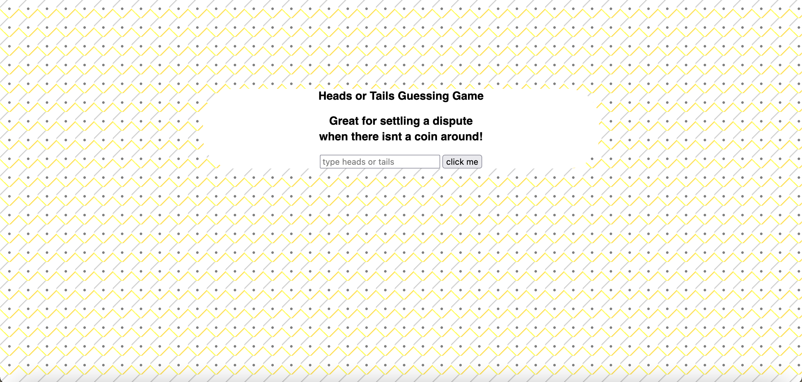

# Coin Flip
This is a project for creating a coin flip game with the javascript logic server side using node.js. The user will enter their guess of heads or tails into the input box and press a button. the request will get sent to the server where the logic will run an algorithm with 50% chance of returning a correct guess, and 50% change of returning an incorrect guess. This can be used to settle disputes when no coin is available :). 

**Link to project:** 

## How It's Made:

**Tech used:** HTML, CSS, JavaScript, node.js

This project was implemented using node.js without express. This means that the node.js core modules had to be hard coded including routes to be able to provide the logic back. A fetch response was used to send out the request, and a response was returned server side.

## Optimizations

## Lessons Learned:

Some great takeaways from this project are implementing node.js without express to see how core modules are used and how to hard code routes to return a response in JSON that is parsed by fetch syntax and provided the statement correct guess or incorrect guess.

## Examples: