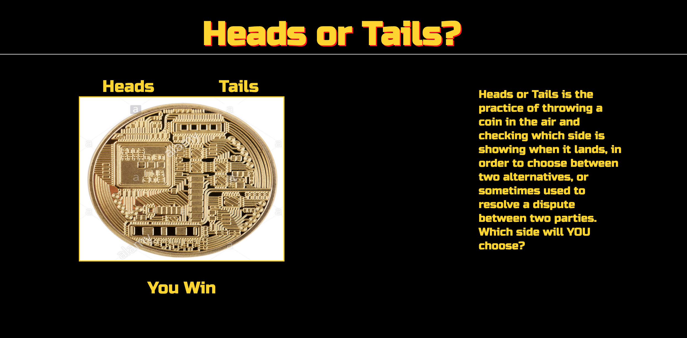

# Heads or Tails
This project utilizes game mechanisms to make a coin flip. User chooses whether they want heads or tails and depending on the random choice match will determine if they win or lost the game.

## How It's Made:

**Tech used:** HTML, CSS, JavaScript, Node.js

I used a Math.ceil(Math.random()) to determine which side the bitcoin should land on. The user chooses which side whether it be heads or tails that they want to play for that match. There are 2 sides to the coin so the randomizer is multiplied by 2. If the choice is 1 it's heads, and if 2 it's tailes.

