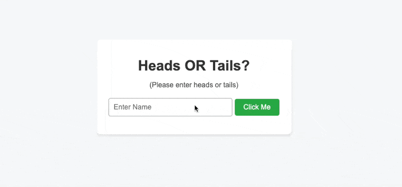

# Coin Flip Server-Side Logic

## Overview

This project is a simple coin flip guessing game, where the server randomly decides if a coin lands on heads or tails, and the user has to guess the outcome. The unique aspect of this project is that all the game logic is handled server-side to prevent users from tampering with the results.

## Learning Outcomes

Through the development of this project, I gained a deeper understanding of server-side logic, HTTP requests, and the integration between client-side and server-side scripts. Here’s a breakdown of my learnings based on the key parts of the code:

### Server-Side Logic (`/api` Endpoint)

```javascript
else if (page == "/api") {
	if ("coin" in params) {
		let result = Math.floor(Math.random() * 2) === 0 ? "heads" : "tails";
		let userGuess = params["coin"].toLowerCase();

		if (userGuess === "") {
			res.writeHead(400, { "Content-Type": "application/json" });
			const objToJson = {
				error: "Invalid input. Parameter 'coin' cannot be an empty string.",
			};
			res.end(JSON.stringify(objToJson));
		} else if (userGuess === "heads" || userGuess === "tails") {
			let isCorrect = userGuess === result;
			res.writeHead(200, { "Content-Type": "application/json" });
			const objToJson = {
				resultOfToss: result,
				userGuessedCorrectly: isCorrect,
			};
			res.end(JSON.stringify(objToJson));
		} else {
			res.writeHead(400, { "Content-Type": "application/json" });
			const objToJson = {
				error: "Invalid input. Please enter 'heads' or 'tails'.",
			};
			res.end(JSON.stringify(objToJson));
		}
	}
}
```

From the `/api` endpoint, I learned how to handle query parameters and provide appropriate responses based on the input. I understood the importance of validating user input and ensuring that the server responds correctly, even when invalid data is sent.

### Client-Side JavaScript

```javascript
document.querySelector("#clickMe").addEventListener("click", makeReq);

function makeReq() {
	const userGuess = document.querySelector("#userName").value.trim();

	fetch(`/api?coin=${userGuess}`)
		.then((response) => response.json())
		.then((data) => {
			console.log(data);
			document.querySelector("#result").textContent = `The coin landed on ${
				data.resultOfToss
			}. You guessed ${
				data.userGuessedCorrectly ? "correctly" : "incorrectly"
			}!`;
		});
}
```

On the client-side, I gained experience in making HTTP requests to the server and handling the JSON responses. I learned how to dynamically update the webpage based on the server's response, providing a real-time interactive experience for the user.

## Project Demo

Below is a gif demonstrating the functionality of the coin flip game:

<p align="center">
  
</p>

## Conclusion

Developing this coin flip game helped cement my understanding of how client-side and server-side scripts interact, the importance of server-side validation, and how to dynamically update web pages based on server responses. It was a valuable step in my journey towards becoming a full-stack developer.
