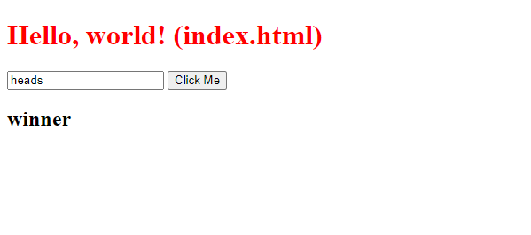

# 💸  Project: Node Coin Flip Game

This is my Coin Flip project, a cool web application built with HTML, CSS, and JavaScript. It's my first project to see how backend works! I was also able to play around with web api's so that was extremly interesting.

## How It's Made

I used HTML, CSS, and JavaScript along with my favorite front-end framework to create this project. This project was made using Node.js, exploring Web api's & modifying to send request to the server side so that user's couldnt manipulate the source code.

## Lessons Learned

I learned alot about how backend functions off this project & was excited to see how client & server side comminuicate!

## Examples

If you want to see more of my work, feel free to explore my portfolio! [GitHub](https://github.com/Michaelariasdls).
