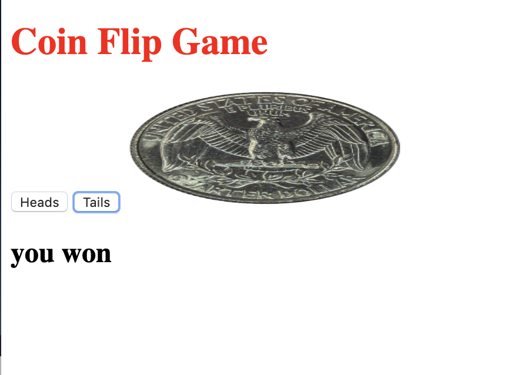

# 💸 Node Coin Flip Game

This is a simple web application that uses the fs and http modules. I used http to create the server and fs to read the html file. The user has the ability to flip a coin and see if they won depending on their choice of 'Heads' or 'Tails'.

Flip a coin here: https://angry-kilby-e23295.netlify.com/

