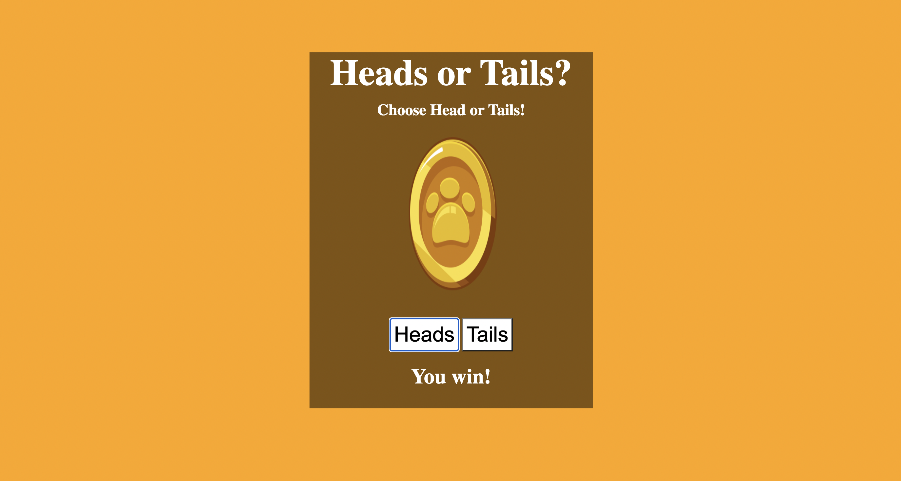

# 💸 Week08 Bootcamp2019a Project: Node Coin Flip Game

### Goal: Create a simple web application that uses the fs and http modules. Use http to create the server and fs to read your html file. Include vanilla ES6 js in a script tag at the bottom of your html file. Try creating a coin flip guessing game

### How to submit your code for review:

[Check out my portfolio][https://tamikasterlin.com/]

