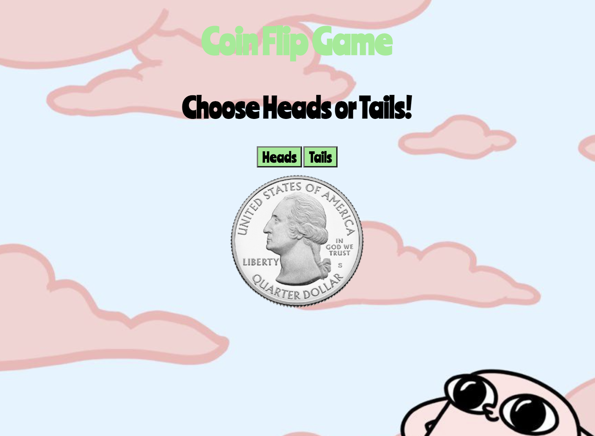

# 💸 Week08 Bootcamp2019a Project: Node Coin Flip Game

# Coin-Flip

This a game in which you try to guess if the coin will land on heads or tails

To see deployed site, visit [The Application here](https://hopeful-hamilton-96af68.netlify.app/). See my other projects there as well!

## Screenshots



### Goal: Create a simple web application that uses the fs and http modules. Use http to create the server and fs to read your html file. Include vanilla ES6 js in a script tag at the bottom of your html file. Try creating a coin flip guessing game

### How to submit your code for review:

- Fork and clone this repo
- Create a new branch called answer
- Checkout answer branch
- Push to your fork
- Issue a pull request
- Your pull request description should contain the following:
  - (1 to 5 no 3) I completed the challenge
  - (1 to 5 no 3) I feel good about my code
  - Anything specific on which you want feedback!

Example:
```
I completed the challenge: 5
I feel good about my code: 4
I'm not sure if my constructors are setup cleanly...
```
