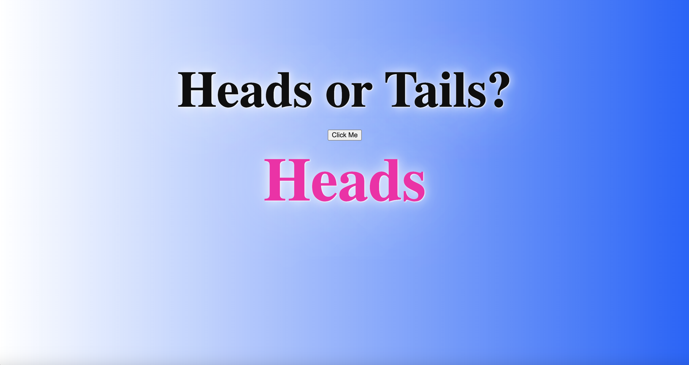

# 💸 Week08 Bootcamp2019a Project: Node Coin Flip Game

### Goal: Create a simple web application that uses the fs and http modules. Use http to create the server and fs to read your html file. Include vanilla ES6 js in a script tag at the bottom of your html file. Try creating a coin flip guessing game

This simple web application is created on the backend server side. It is hosted locally. It allows for the user to guess their luck by clicking on a button and seeing if it is heads or tails.

## How It's Made:

**Tech used:** HTML, CSS, JavaScript, Node.js

## Lessons Learned:

This was a good introduction to backend and there is much more to learn ahead.