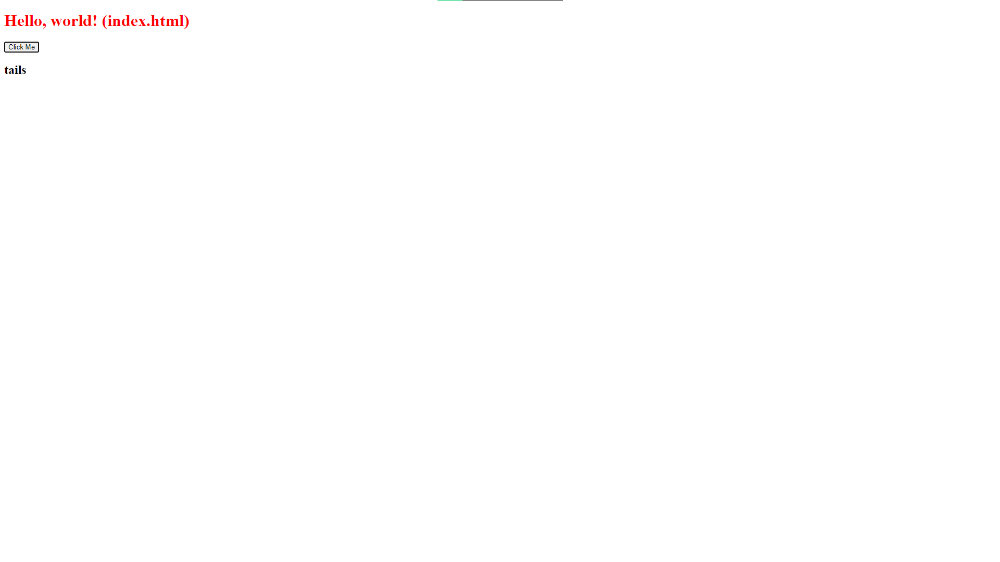

# Coin Flip Game 🪙

  

## Project Description

### Goal
Create a simple web application that uses the fs and http modules. Use http to create the server and fs to read your HTML file. Include vanilla ES6 JS in a script tag at the bottom of your HTML file. Try creating a coin flip guessing game.

## How It's Made

### Tech used

- HTML
- CSS
- Node.js
- Vanilla JavaScript (ES6)

### Implementation Details

- **HTML and CSS:**
  - Basic HTML structure and CSS styling for a user-friendly interface.

- **Node.js:**
  - Server creation using the http module, and reading HTML file using the fs module.

- **Vanilla JS (ES6):**
  - Backend logic for the coin flip guessing game.

- **Figlet for Error Message:**
  - Utilized Figlet for enhanced error messages.

## Optimizations (Optional)

No specific optimizations were made for this project.

## Lessons Learned 📚

This project marked my second venture, where I created a web application for a coin flip guessing game with backend logic.

- **Server Creation:**
  - Gained understanding and hands-on experience in creating and starting a server using Node.js.

- **Backend Interaction:**
  - Learned how to grab data from the user on the backend and display results in the DOM.

- **Node Modules:**
  - Knowledge gained about using Node modules for enhanced functionality and modularity.

## Getting Started 🚀

To get this project up and running, follow these simple steps:

1. **Clone Repository:**
   - Clone this repository using `git clone`.

2. **Navigate to the Project:**
   - `cd` into the project directory.

3. **Install Dependencies:**
   - Run `npm install` to install the necessary dependencies.

4. **Start the Server:**
   - Run `node server.js` to start the server.

5. **Open in Browser:**
   - Visit `http://localhost:8000` in your web browser.

Enjoy flipping coins and guessing the outcome!