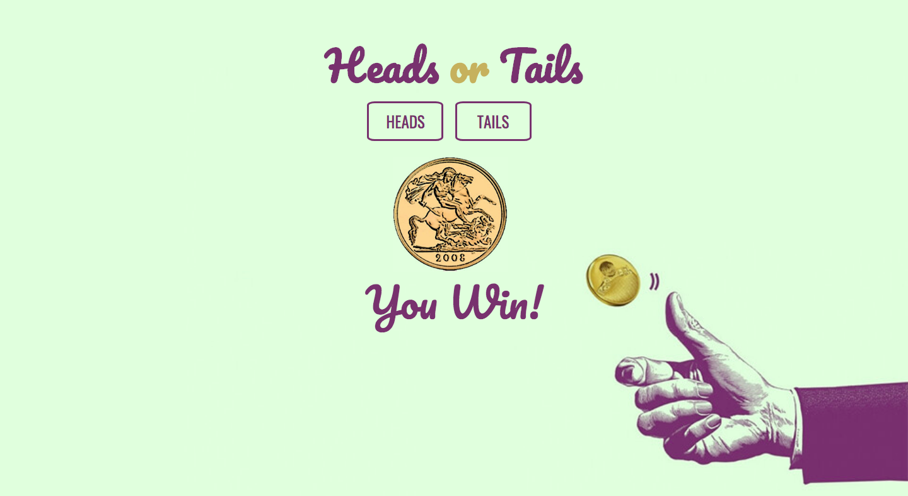

# 💸  Node Coin Flip Game

### Goal: Create a simple web application that uses the fs and http modules. Use http to create the server and fs to read your html file. Include vanilla ES6 js in a script tag at the bottom of your html file. Try creating a coin flip guessing game.

## Design and Development:
**Tech Used** HTML, CSS, JavaScript, Node:
Used JavaScript to randomize heads or tails. Only HTML file is hosted through Node, which is why CSS and JS are in HTML file.

## Reflections:
Simple Heads or Tails guessing game!
