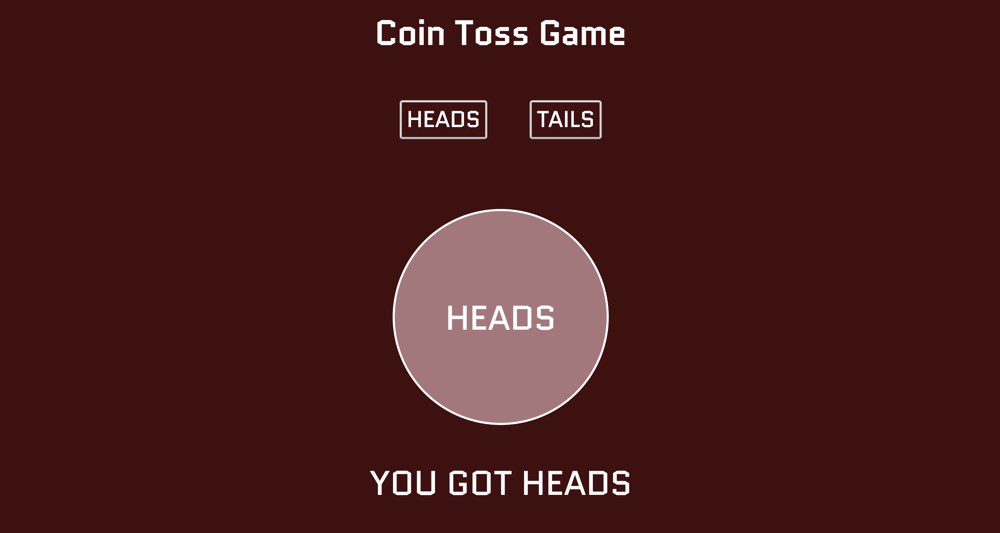

# Coin Toss Game

## Challenge: Create a simple web application that uses the fs and http modules. Use http to create the server and fs to read your html file. Include vanilla ES6 js in a script tag at the bottom of your html file. Try creating a coin flip guessing game

## Give it a try here: https://clever-bartik-adda51.netlify.com/

Techologies Used:
- HTML 
- CSS 
- node.js 

