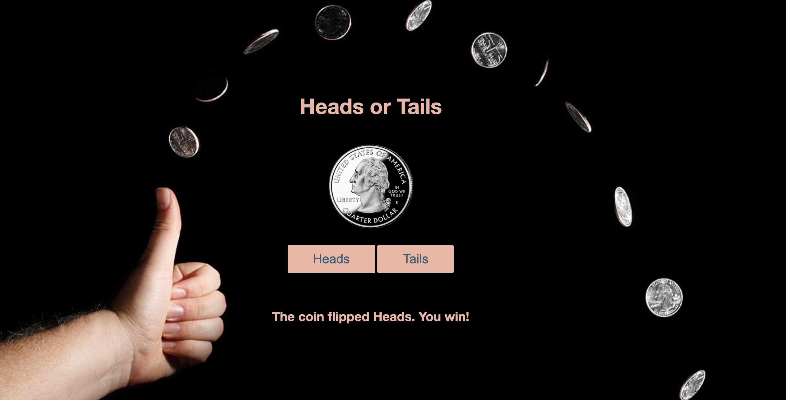

# 💸  Node Coin Flip Game

## How It's Made:

**Tech used:** HTML, CSS, JavaScript, NodeJS

## Lessons Learned:
In order to create the Coin Flip Game, I used the http, fs, and url modules. Javascript was rendered on the client-side and served on the server. 
