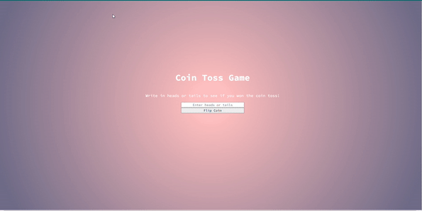

# Coin Toss Game

Welcome to my Coin Toss Game project. This simple web application uses the `fs` (File System) and `http` modules in Node.js. The application creates an HTTP server and reads an HTML file that includes a vanilla ES6 JavaScript script. The game challenges you to guess the outcome of a coin flip.

## How It's Made

Technologies Used: HTML, CSS, JavaScript, Node.js (fs and http modules)

In this project, I built a coin flip guessing game using Node.js's `http` module to create a server and the `fs` module to read an HTML file. The game is embedded in the HTML file with a vanilla ES6 JavaScript script. 

The game works by allowing users to guess the outcome of a coin flip (heads or tails). After making a selection, the application generates a random coin flip result and checks if the user's guess is correct. The result is then displayed to the user. The game is a simple and fun exercise in interactive web development.

## Optimizations (optional)

While this project is relatively straightforward, I focused on delivering an efficient and engaging user experience. I ensured that the code was well-structured and optimized for performance. I also considered making the application responsive and user-friendly, which resulted in a smoother interaction for players.

## Lessons Learned

Building this Coin Flip Guessing Game was a valuable learning experience. It reinforced the importance of continuously expanding my skill set and seeking new challenges. I encountered moments of excitement as I implemented various game logic components, from user input to randomization and result presentation.

No matter the experience level, being an engineer means constantly learning and growing. This project served as a reminder of the joy of building interactive applications and the satisfaction of creating something entertaining and functional.

