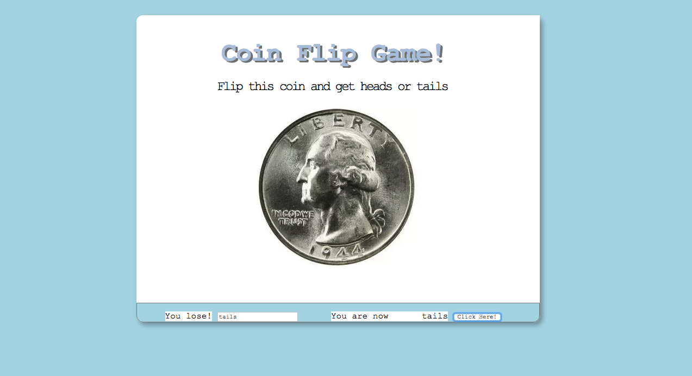

# Coin Flip Game
In this project, user flips a coin by entering what side they'd like to choose--either heads or tails. If the image returned is the opposite of what they chose, they win. If not, they lose.

## How It's Made:

**Tech used:** HTML, CSS, JavaScript
I started off with creating a randomization of the results on the click which produced a random heads or tails image. I implemented the Math.random() function to do this. A conditional was used to compare the randomization to the number of clicks that would make the outcome unique each time.
