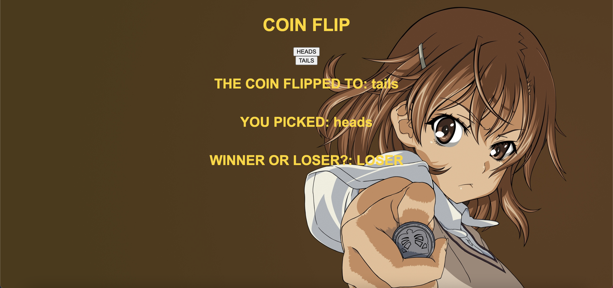

This is a coin flip generator where the player will guess 'Heads' or 'Tails' after choosing, the coin will flip and land on either 'Heads' or 'Tails'.

Link to Project: [https://juliedodev-coinflip.netlify.app/]

How It's Made:

Tech Used: HTML, CSS, JavaScript, Node.js

Optimizations: 

Lesson Learned: I learned how to randomize the 'Heads' or 'Tails' to have a 50% chance of being landed on in this application.

