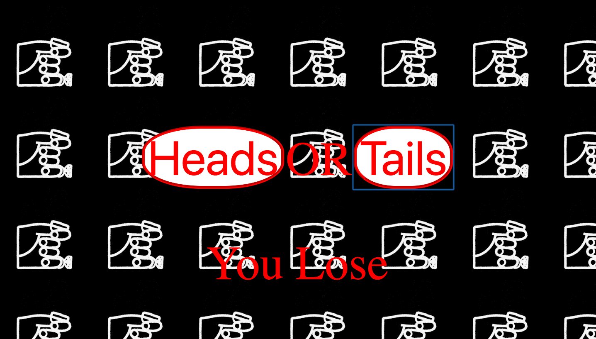

# My Name Generator Project
Goal: Create a simple web application that uses the fs and http modules. Use http to create the server and fs to read your html file. Include vanilla ES6 js in a script tag at the bottom of your html file. Try creating a coin flip guessing game

## How It's Made:

**Tech used:** HTML, CSS, JavaScript, Framework of choice

## Lessons Learned:

For this project I cemented my knowledge on how to change the contents of text in html through the use of js and .textContent .

