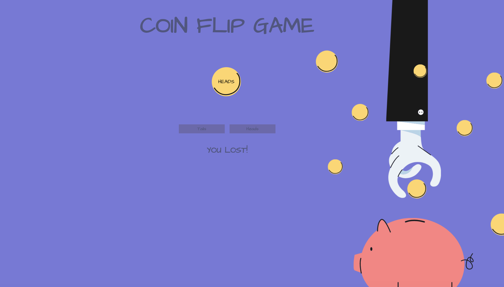

# 💸 Week08 Bootcamp2019a Project: Node Coin Flip Game

# Description: 

Created a simple web application that uses the fs and http modules. User's can guess heads or tails, and the server side will tell them if they guessed correctly or not.

# Tech Used:

 HTML, CSS, JS, API, JSON, NODE.JS

