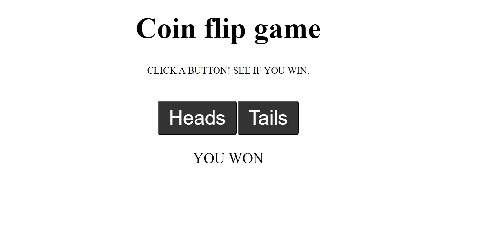

# Node Coin Flip Game

A coin flip guessing game. Click a button to select heads or tails and the server will deliver a 'you won' or 'you lost' message if your selection matches the randomly generated value.

# How it's made
Tech used: HTML, CSS, JavaScript, Node.js

# Lessons learned:
This project helped me get familiar with the require() function which is built-in CommonJS module function supported in Node.js that lets you include modules within your project. This is a simple web application that uses the fs and http modules. The http module was used to create the server and fs module was used to read the HTML file.

This project was built using raw Node.js. I have a deep apprecation for Express as a result of this.

